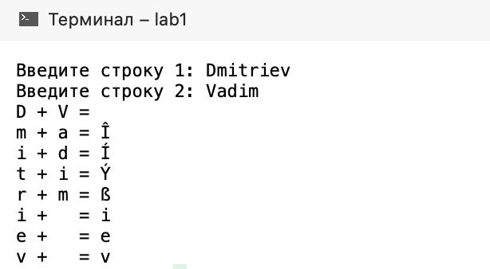
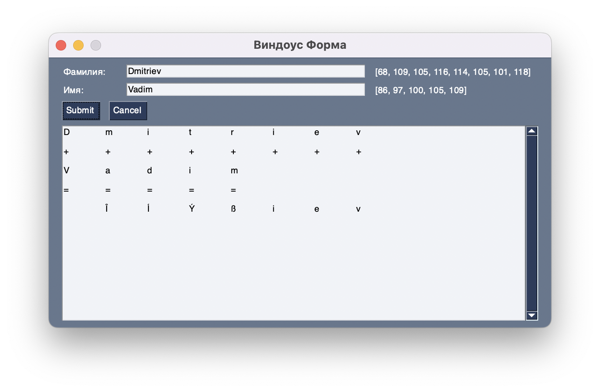
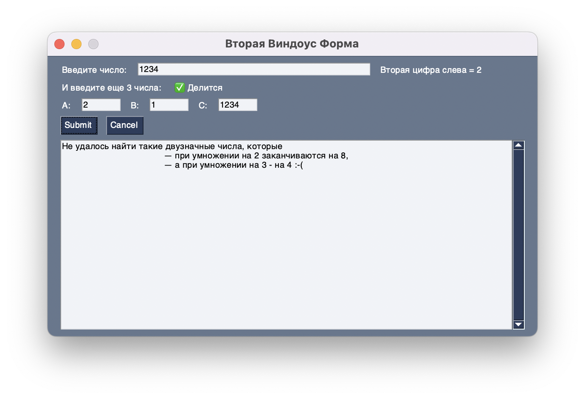
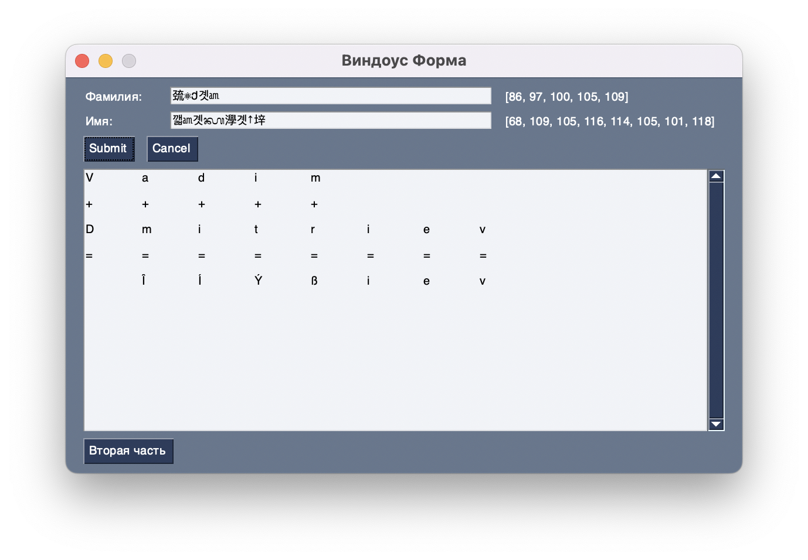

Цель работы:

Получить навыки работы с основными инструментами среды программирования
Microsoft Visual Studio 2019. Создать программу с использованием Windows
Forms на языках С\#, С++, C.

# Часть 1. 

Задание (Вариант №12\*):

Реализовать механизм шифрования и расшифрования битового потока
информации, где ключевая последовательность генерируется линейным
регистром с обратными связями, определяемыми неприводимым полиномом.

Ход работы:

Программа разделена на условные 2 части: шифрование и расшифрование
строки. Ключевая последовательность генерируется с помощью 4-битового
регистра сдвига с линейной обратной с отводами от последних 2 битов,
которые генерируют новый бит с помощью операции XOR (Рисунок 1).

Рисунок 1 -- Схема работы РСЛОС с его состояниям

Шифрование осуществляется с помощью операции XOR между битами исходной
строки и ключевой последовательностью, сгенерированной РСЛОС. Регистр
генерирует новые биты ключа для каждого бита исходного сообщения.

Расшифровка осуществляется идентично шифрованию, для этого необходимы
лишь зашифрованная строка и начальное состояние РСЛОС, которое
использовалось для шифрования этой же строки.

# Часть 2.1.

Задание:

Создать консольный и Windows Forms проекты, выполняющие поразрядное
сложение двух строк (вашей фамилии и имени) с выводом промежуточных
результатов.

Ход работы:

После запуска, программа ожидает от пользователя ввод фамилии и имени с
клавиатуры. После этого программа побуквенно рассматривает эти строки и
формирует новую результирующую строку путем сложения кодов ASCII i-ых
символов в обоих строках. Если строки разной длины, то разница
дописывается к ответу без изменений.

Результат работы консольного проекта:

Рисунок 2 - Поразрядное сложение строк

Результаты работы Windows Forms проекта (из-за ограничений операционной системы macOS, проект выполнен на языке
программирования Python с использованием модуля PySimpleGUI):

Рисунок 3 - Заполненная форма

# Часть 2.2.

Задание: (Вариант 7)

1.  Дано натуральное число:

> \- найти вторую (слева) цифру данного числа;
>
> \- определить, верно ли, что данное число делится на A, B и C (A, B и
> C вводится с клавиатуры).
>
> 2\. Найти все двузначные числа, которые при умножении на 2
> заканчиваются на 8, а при умножении на 3 - на 4.

Ход работы:

1.  ***Найти вторую (слева) цифру данного числа***

Программа приглашает пользователя ввести число в формате: «Введите
число:». Проверяется корректность ввода данных. Если вводится не число,
то программа сообщает об этом в формате: «Введено не число» и завершает
работу. Если введено число, то на экран выводится ответ в формате:
«Вторая цифра слева = ».

2.  ***Определить, верно ли, что данное число делится на A, B и C***

Числа A, B и С вводятся так же, как в предыдущем модуле. И в случае
непрохождения проверки на число, на экран так же выводится сообщение об
этом в формате: «Введено не число». После успешного ввода всех трех
чисел A, B и С также осуществляется проверка на нулевое деление. И после
этого в зависимости от того делится ли данное число на A, B и С без
остатка, программа сообщает пользователю результат в формате: «Делится
без остатка» или «Не делится без остатка».

3.  ***Найти все двузначные числа, которые при умножении на 2
    заканчиваются на 8, а при умножении на 3 - на 4.***

Программа последовательно обрабатываются числа от 10 до 99 и проверяет
их на соответствие условию. Если число при умножении на 2 заканчиваются
на 8, а при умножении на 3 - на 4, то оно выводится на экран. Если таких
чисел не нашлось, то программа сообщает об этом в формате: «Таких чисел
не найдено».

Результат работы консольного проекта:

Рисунок 4 -- Вторая часть задания

Результаты работы Windows Forms проекта (из-за ограничений операционной системы macOS, проект выполнен на языке
программирования Python с использованием модуля PySimpleGUI):

Рисунок 5 - Заполненная форма

# Дополнительное задание.

Задание:

RSA к ФИ: применение шифрования RSA к фамилии и имени.

Ход работы:

Открытый и секретный ключи генерируются с помощью подключаемой
библиотеки rsa. Шифрование происходит путем возведения в степень E кодов
всех символов исходной строки и взятия результатов по модулю N.
Результат шифрования выводится в виде символов Unicode на форму вместо
исходных Фамилии и Имени.

Результаты работы программы:

Рисунок 6 - Заполненная форма

# Выводы:

1.  Получены навыки работы с основными инструментами среды
    программирования Microsoft Visual Studio 2019.

2.  Создана программа с использованием Windows Forms на языке С\# и
    программы на языке C\#, C++, C
