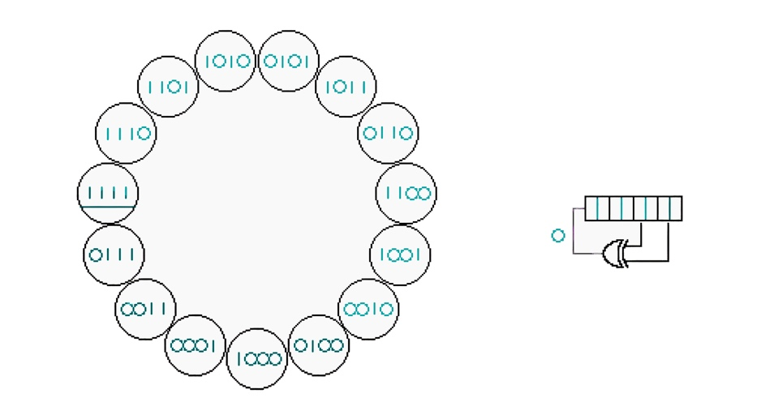
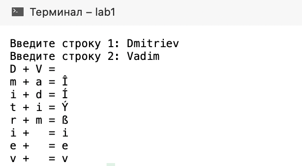
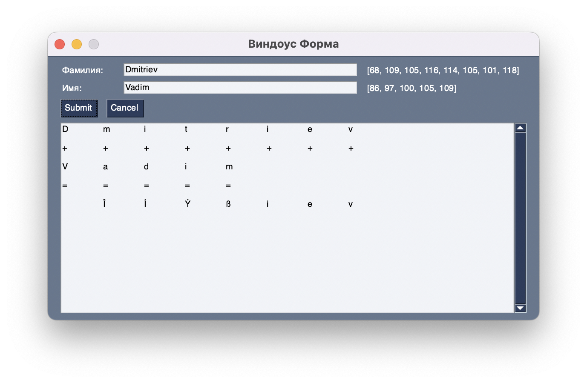
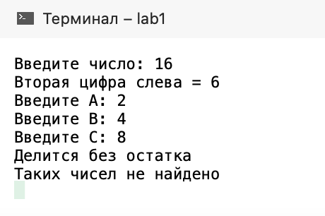
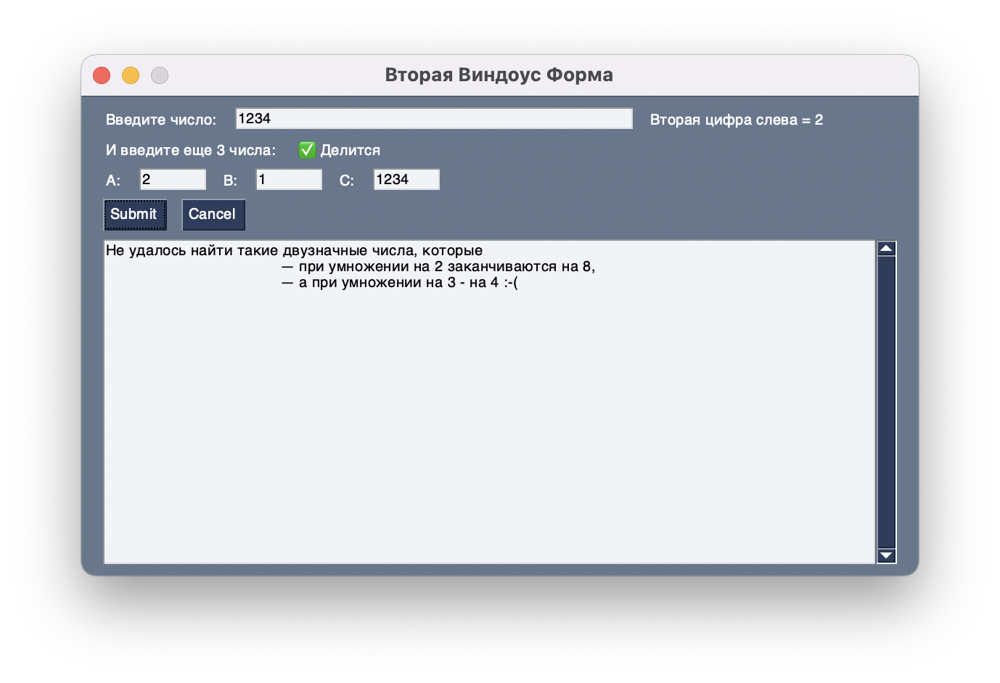
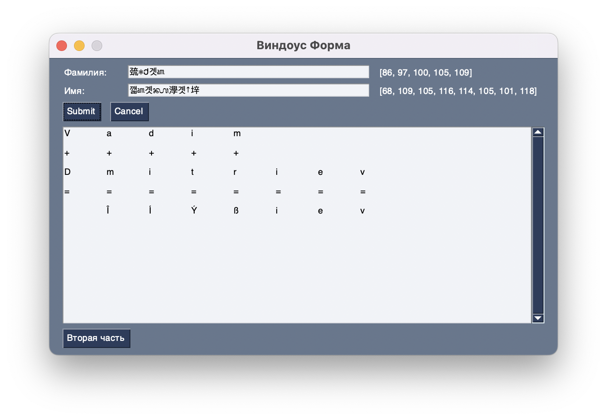

МИНИСТЕРСТВО НАУКИ И ВЫСШЕГО ОБРАЗОВАНИЯ РОССИЙСКОЙ ФЕДЕРАЦИИ

федеральное государственное автономное образовательное учреждение
высшего образования

«САНКТ-ПЕТЕРБУРГСКИЙ ГОСУДАРСТВЕННЫЙ УНИВЕРСИТЕТ

АЭРОКОСМИЧЕСКОГО ПРИБОРОСТРОЕНИЯ»

> КАФЕДРА №33

ОТЧЕТ ЗАЩИЩЕН С ОЦЕНКОЙ\_\_\_\_\_\_\_\_\_\_\_\_\_\_\_\_\_\_\_\_\_

ПРЕПОДАВАТЕЛЬ

  -------------------------------- -- --------------- -- -------------------
  канд. техн. наук, профессор                            С. Г. Фомичева
  должность, уч. степень, звание      подпись, дата      инициалы, фамилия
  -------------------------------- -- --------------- -- -------------------

> ОТЧЕТ О ЛАБОРАТОРНОЙ РАБОТЕ № 1
>
> РАЗРАБОТКА КОНСОЛЬНЫХ И WINDOWS FORMS ПРОГРАММ С ИСПОЛЬЗОВАНИЕМ ЯЗЫКОВ
> C\#, C++, C
>
> по курсу: ТЕХНОЛОГИИ И МЕТОДЫ ПРОГРАММИРОВАНИЯ

  --------------- -------------- -- --------------- -- -------------------
  СТУДЕНТ ГР. №   3031                                 В. Е. Дмитриев
                  номер группы      подпись, дата      инициалы, фамилия
  --------------- -------------- -- --------------- -- -------------------

> Санкт-Петербург
>
> 2022

Цель работы:

Получить навыки работы с основными инструментами среды программирования
Microsoft Visual Studio 2019. Создать программу с использованием Windows
Forms на языках С\#, С++, C.

# Часть 1. 

Задание (Вариант №12\*):

Реализовать механизм шифрования и расшифрования битового потока
информации, где ключевая последовательность генерируется линейным
регистром с обратными связями, определяемыми неприводимым полиномом.

Ход работы:

Программа разделена на условные 2 части: шифрование и расшифрование
строки. Ключевая последовательность генерируется с помощью 4-битового
регистра сдвига с линейной обратной с отводами от последних 2 битов,
которые генерируют новый бит с помощью операции XOR (Рисунок 1).

{width="4.263888888888889in"
height="2.254372265966754in"}

Рисунок 1 -- Схема работы РСЛОС с его состояниям

Шифрование осуществляется с помощью операции XOR между битами исходной
строки и ключевой последовательностью, сгенерированной РСЛОС. Регистр
генерирует новые биты ключа для каждого бита исходного сообщения.

Расшифровка осуществляется идентично шифрованию, для этого необходимы
лишь зашифрованная строка и начальное состояние РСЛОС, которое
использовалось для шифрования этой же строки.

Листинг кода:

**static** **unsigned** **int** S = 0xF;

**int** LFSR_Fibonacci (**void**) {

S = ((((S \>\> 1) \^ S ) & 0x1 ) \<\< 3) \| (S \>\> 1); //

**return** S & 0x1;

}

**int** main() {

**register** **unsigned** **int** initial_state = 0xF;

printf(\"\-\-\-\--Шифруем\-\-\-\--\\n\");

S = initial_state;

**char** message\[\] = \"Hello!\";

**unsigned** **char** enc\[256\];

**int** a\[256\];

**int** size = **sizeof**(message)/**sizeof**(**char**) -1;

**for** (**int** i = 0; i \< size; i++) {

**unsigned** **int** tmp = 0;

**for** (**int** j = 7; j \>=0; j\--) {

**int** genbit = LFSR_Fibonacci() & 0x1;

tmp = (tmp \<\< 1) \| (genbit \^ ((message\[i\] \>\> j) & 0x01));

printf(\"%x = %x \^ (%x \>\> %d) & 0x01)\\n\", tmp, genbit,
message\[i\], j);

}

enc\[i\] = tmp;

printf(\"%x (%c) -\> %x (%c)\\n\", message\[i\], message\[i\], enc\[i\],
enc\[i\]);

}

enc\[size-1\] = \'\\0\';

printf(\"%s -\> %s\\n\\n\\n\", message, enc);

printf(\"\-\-\-\--Расшифровываем\-\-\-\--\\n\");

S = initial_state;

**char** plain\[256\];

**for** (**int** i = 0; i \< size; i++) {

**unsigned** **int** tmp = 0;

**for** (**int** j = 7; j \>=0; j\--) {

**int** genbit = LFSR_Fibonacci() & 0x1;

tmp = (tmp \<\< 1) \| (genbit \^ ((enc\[i\] \>\> j) & 0x01));

printf(\"%x = %x \^ (%x \>\> %d) & 0x01)\\n\", tmp, genbit, enc\[i\],
j);

}

plain\[i\] = tmp;

printf(\"%x (%c) -\> %x (%c)\\n\", enc\[i\], enc\[i\], plain\[i\],
plain\[i\]);

}

plain\[size-1\] = \'\\0\';

printf(\"%s -\> %s\\n\\n\\n\", enc, plain);

}

# Часть 2.1.

Задание:

Создать консольный и Windows Forms проекты, выполняющие поразрядное
сложение двух строк (вашей фамилии и имени) с выводом промежуточных
результатов.

Ход работы:

После запуска, программа ожидает от пользователя ввод фамилии и имени с
клавиатуры. После этого программа побуквенно рассматривает эти строки и
формирует новую результирующую строку путем сложения кодов ASCII i-ых
символов в обоих строках. Если строки разной длины, то разница
дописывается к ответу без изменений.

1)  Листинг кода Консольного проекта:

Console.Write(\"Введите строку 1: \");

char\[\] str1 = Console.ReadLine().ToCharArray();

Console.Write(\"Введите строку 2: \");

char\[\] str2 = Console.ReadLine().ToCharArray();

int end = 0;

for (int i = 0; i \< str1.Length && i \< str2.Length; i++)

{

Console.WriteLine(\$\"{str1\[i\]} + {str2\[i\]} = {(char)(str1\[i\] +
str2\[i\])}\");

end = i + 1;

}

while (end \< str2.Length)

{

Console.WriteLine(\$\" + {str2\[end\]} = {str2\[end\]}\");

end++;

}

while (end \< str1.Length)

{

Console.WriteLine(\$\"{str1\[end\]} + = {str1\[end\]}\");

end++;

}

Результат работы программы:

{width="4.263888888888889in"
height="2.3472222222222223in"}

Рисунок 2 - Поразрядное сложение строк

2)  Листинг кода Windows Forms проекта:

(Из-за ограничений операционной системы macOS, проект выполнен на языке
программирования Python с использованием модуля PySimpleGUI)

**import** PySimpleGUI **as** sg\
\
layout = \[\
\[sg.Text(**\'Фамилия:\'**, size=(10, 1)), sg.InputText(),
sg.Text(key=**\'ASCII1\'**)\],*\
*\[sg.Text(**\'Имя:\'**, size=(10, 1)), sg.InputText(),
sg.Text(key=**\'ASCII2\'**)\],*\
*\[sg.Submit(), sg.Cancel()\],\
\[sg.Output(size=(88, 20), key=**\'\_output\_\'**)\],\
\[sg.Button(**\"Вторая часть\"**, key=**\"part2\"**)\]\
\]\
\
window = sg.Window(**\'Виндоус Форма\'**, layout)\
\
**while True**: *\# The Event Loop\
*event, values = window.read()*\
***if** event **in** (**None**, **\'Exit\'**, **\'Cancel\'**):\
**break\
if** event == **\'Submit\'**:\
window\[**\'\_output\_\'**\].Update(**\'\'**)\
**if** values\[0\] **and** values\[1\]:\
print(**\"\\t\"**.join(values\[0\]), end=**\"\\n\\n\"**)\
print(**\"\\t\"**.join(**\"+\"** \* len(values\[0\])),
end=**\"\\n\\n\"**)\
print(**\"\\t\"**.join(values\[1\]), end=**\"\\n\\n\"**)\
print(**\"\\t\"**.join(**\"=\"** \* len(values\[1\])),
end=**\"\\n\\n\"**)\
i = 0\
result = **\"\"\
**ascii_list = \[list(), list()\]\
**while** i \< len(values\[0\]) **and** i \< len(values\[1\]):\
ascii_list\[0\].append(ord(values\[0\]\[i\]))\
ascii_list\[1\].append(ord(values\[1\]\[i\]))\
add = chr(ascii_list\[0\]\[i\] + ascii_list\[1\]\[i\])\
result += add\
i += 1\
print(add, end=**\"\\t\"**)\
who = 0\
**if** i \< len(values\[1\]):\
who = 1\
**while** i \< len(values\[who\]):\
ascii_list\[who\].append(ord(values\[who\]\[i\]))\
add = values\[who\]\[i\]\
result += add\
i += 1\
print(add, end=**\"\\t\"**)\
window\[**\'ASCII1\'**\].Update(value=str(ascii_list\[0\]))\
window\[**\'ASCII2\'**\].Update(value=str(ascii_list\[1\]))\
**else**:\
print(**\'Please enter 2 strings.\'**)\
window.close()

Результаты работы программы:

{width="7.086805555555555in"
height="4.628472222222222in"}

Рисунок 3 - Заполненная форма

# Часть 2.2.

Задание: (Вариант 7)

1.  Дано натуральное число:

> \- найти вторую (слева) цифру данного числа;
>
> \- определить, верно ли, что данное число делится на A, B и C (A, B и
> C вводится с клавиатуры).
>
> 2\. Найти все двузначные числа, которые при умножении на 2
> заканчиваются на 8, а при умножении на 3 - на 4.

Ход работы:

1.  ***Найти вторую (слева) цифру данного числа***

Программа приглашает пользователя ввести число в формате: «Введите
число:». Проверяется корректность ввода данных. Если вводится не число,
то программа сообщает об этом в формате: «Введено не число» и завершает
работу. Если введено число, то на экран выводится ответ в формате:
«Вторая цифра слева = ».

2.  ***Определить, верно ли, что данное число делится на A, B и C***

Числа A, B и С вводятся так же, как в предыдущем модуле. И в случае
непрохождения проверки на число, на экран так же выводится сообщение об
этом в формате: «Введено не число». После успешного ввода всех трех
чисел A, B и С также осуществляется проверка на нулевое деление. И после
этого в зависимости от того делится ли данное число на A, B и С без
остатка, программа сообщает пользователю результат в формате: «Делится
без остатка» или «Не делится без остатка».

3.  ***Найти все двузначные числа, которые при умножении на 2
    заканчиваются на 8, а при умножении на 3 - на 4.***

Программа последовательно обрабатываются числа от 10 до 99 и проверяет
их на соответствие условию. Если число при умножении на 2 заканчиваются
на 8, а при умножении на 3 - на 4, то оно выводится на экран. Если таких
чисел не нашлось, то программа сообщает об этом в формате: «Таких чисел
не найдено».

1)  Листинг кода Консольного проекта:

bool IsDigitsOnly(string str)

{

foreach (char c in str)

{

if (c \< \'0\' \|\| c \> \'9\')

return false;

}

return true;

}

/\*\-\-\-\-\-\-\-\-\-\-\-\--Часть 1\-\-\-\-\-\-\-\-\-\-\-\-\-\--\*/

Console.Write(\"Введите число: \");

int num;

String str = Console.ReadLine();

if (IsDigitsOnly(str))

{

num = Convert.ToInt32(str);

if (num \< 10)

{

Console.WriteLine(\$\"В числе всего одна цифра = {num}\");

}

else

{

int tmp = num;

while (tmp \> 99)

{

tmp /= 10;

}

Console.WriteLine(\$\"Вторая цифра слева = {tmp % 10}\");

}

}

else

{

Console.WriteLine(\$\"Введено не число\");

return;

}

/\*\-\-\-\-\-\-\-\-\-\-\-\--Часть 2\-\-\-\-\-\-\-\-\-\-\-\-\-\--\*/

Console.Write(\"Введите A: \");

int A;

str = Console.ReadLine();

if (IsDigitsOnly(str))

{

A = Convert.ToInt32(str);

}

else

{

Console.WriteLine(\$\"Введено не число\");

return;

}

Console.Write(\"Введите B: \");

int B;

str = Console.ReadLine();

if (IsDigitsOnly(str))

{

B = Convert.ToInt32(str);

}

else

{

Console.WriteLine(\$\"Введено не число\");

return;

}

Console.Write(\"Введите C: \");

int C;

str = Console.ReadLine();

if (IsDigitsOnly(str))

{

C = Convert.ToInt32(str);

}

else

{

Console.WriteLine(\$\"Введено не число\");

return;

}

if (A == 0 \|\| B == 0 \|\| C == 0)

{

Console.WriteLine(\$\"На ноль делить нельзя\");

}

else if (num % A == 0 && num % B == 0 && num % C == 0)

{

Console.WriteLine(\"Делится без остатка\");

}

else

{

Console.WriteLine(\"Не делится без остатка\");

}

/\*\-\-\-\-\-\-\-\-\-\-\-\--Часть 3\-\-\-\-\-\-\-\-\-\-\-\-\-\--\*/

bool were = false;

for (int i = 10; i \< 100; i++)

{

if (i \* 2 % 10 == 8 && i \* 3 % 10 == 4)

{

Console.WriteLine(i);

were = true;

}

}

if (!were)

{

Console.WriteLine(\"Таких чисел не найдено\");

}}

Результаты выполнения программы:

{width="3.1944444444444446in"
height="2.125in"}

Рисунок 4 -- Вторая часть задания

1)  Листинг кода Windows Forms проекта:

(Из-за ограничений операционной системы macOS, проект выполнен на языке
программирования Python с использованием модуля PySimpleGUI)

**import** PySimpleGUI **as** sg\
\
layout2 = \[\
\[sg.Text(**\'Введите число:\'**), sg.InputText(),
sg.Text(key=**\'2_left_num\'**)\],\
\[sg.Text(**\'И введите еще 3 числа:\'**),
sg.Text(key=**\'divides\'**)\],\
\[sg.Text(**\'А:\'**), sg.InputText(size=(7, 1)),\
sg.Text(**\'B:\'**), sg.InputText(size=(7, 1)),\
sg.Text(**\'C:\'**), sg.InputText(size=(7, 1))\],\
\[sg.Submit(), sg.Cancel()\],\
\[sg.Output(size=(88, 20), key=**\'\_output\_\'**)\],\
\]

window2 = sg.Window(**\"Вторая Виндоус Форма\"**, layout2)

**while True**: *\# The Event Loop\
*event2, nums = window2.read()*\
***if** event2 **in** (**None**, **\'Exit\'**, **\'Cancel\'**):\
window2.close()\
**break\
if** event2 == **\'Submit\'**:\
**try**:\
**if** nums\[0\]:\
nums\[0\] = int(nums\[0\])\
window2\[**\'2_left_num\'**\].Update(\
value=**\"Too few digits\" if** nums\[0\] \< 10 **else**
str(nums\[0\])\[1\]\
)\
**if** nums\[1\] **and** nums\[2\] **and** nums\[2\]:\
nums\[1\] = int(nums\[1\])\
nums\[2\] = int(nums\[2\])\
nums\[3\] = int(nums\[3\])\
**if** (nums\[1\] == 0 **or** nums\[2\] == 0 **or** nums\[3\] == 0):\
window2\[**\'divides\'**\].Update(value=str(**\"Нулевые числа\"**))\
**else**:\
**if** nums\[0\] % nums\[1\] == 0

**and** nums\[0\] % nums\[2\] == 0

**and** nums\[0\] % nums\[3\] == 0:\
window2\[**\'divides\'**\].Update(value=str(**\"✅ Делится\"**))\
**else**:\
window2\[**\'divides\'**\].Update(value=str(**\"❌ Не делится\"**))\
**else**:\
window2\[**\'divides\'**\].Update(value=str(**\"Нужно все 3 числа\"**))\
**else**:\
window2\[**\'2_left_num\'**\].Update(value=**\"Это поле должно быть
заполнено\"**)\
*\
*count = 0\
**for** i **in** range(10, 100):\
**if** i \* 2 % 10 == 8 **and** i \* 3 % 10 == 4:\
print(i)\
count += 1\
**if** count == 0:\
print(**\'\'\'Не удалось найти такие двузначные числа, которые\
--- при умножении на 2 заканчиваются на 8,\
--- а при умножении на 3 - на 4 :-(\'\'\'**)\
**except**:\
print(**\"Должны быть только числа\"**)\
window.close()

Результаты работы программы:

{width="5.872549212598425in"
height="4.0144717847769025in"}

Рисунок 5 - Заполненная форма

# Дополнительное задание.

Задание:

RSA к ФИ: применение шифрования RSA к фамилии и имени.

Ход работы:

Открытый и секретный ключи генерируются с помощью подключаемой
библиотеки rsa. Шифрование происходит путем возведения в степень E кодов
всех символов исходной строки и взятия результатов по модулю N.
Результат шифрования выводится в виде символов Unicode на форму вместо
исходных Фамилии и Имени.

Листинг кода:

**import** PySimpleGUI **as** sg\
**import** rsa\
\
layout = \[\
\[sg.Text(**\'Фамилия:\'**, size=(10, 1)), sg.InputText(),
sg.Text(key=**\'ASCII1\'**)\],*\
*\[sg.Text(**\'Имя:\'**, size=(10, 1)), sg.InputText(),
sg.Text(key=**\'ASCII2\'**)\],*\
*\[sg.Submit(), sg.Cancel()\],\
\[sg.Output(size=(88, 20), key=**\'\_output\_\'**)\],\
\[sg.Button(**\"Вторая часть\"**, key=**\"part2\"**)\]\
\]\
\
window = sg.Window(**\'Виндоус Форма\'**, layout)\
\
**while True**: *\# The Event Loop\
*event, values = window.read()*\
***if** event **in** (**None**, **\'Exit\'**, **\'Cancel\'**):\
**break\
if** event == **\'Submit\'**:\
window\[**\'\_output\_\'**\].Update(**\'\'**)\
**if** values\[0\] **and** values\[1\]:\
print(**\"\\t\"**.join(values\[0\]), end=**\"\\n\\n\"**)\
print(**\"\\t\"**.join(**\"+\"** \* len(values\[0\])),
end=**\"\\n\\n\"**)\
print(**\"\\t\"**.join(values\[1\]), end=**\"\\n\\n\"**)\
print(**\"\\t\"**.join(**\"=\"** \* len(values\[1\])),
end=**\"\\n\\n\"**)\
i = 0\
result = **\"\"\
**ascii_list = \[list(), list()\]\
**while** i \< len(values\[0\]) **and** i \< len(values\[1\]):\
ascii_list\[0\].append(ord(values\[0\]\[i\]))\
ascii_list\[1\].append(ord(values\[1\]\[i\]))\
add = chr(ascii_list\[0\]\[i\] + ascii_list\[1\]\[i\])\
result += add\
i += 1\
print(add, end=**\"\\t\"**)\
who = 0\
**if** i \< len(values\[1\]):\
who = 1\
**while** i \< len(values\[who\]):\
ascii_list\[who\].append(ord(values\[who\]\[i\]))\
add = values\[who\]\[i\]\
result += add\
i += 1\
print(add, end=**\"\\t\"**)\
window\[**\'ASCII1\'**\].Update(value=str(ascii_list\[0\]))\
window\[**\'ASCII2\'**\].Update(value=str(ascii_list\[1\]))\
\
(pubkey, privkey) = rsa.newkeys(16)*\
*encrypted_surname = encrypted_name = str()\
**for** i **in** range(len(values\[0\])):\
encrypted_surname += chr(ord(values\[0\]\[i\]) \*\* pubkey.e %
pubkey.n)\
**for** i **in** range(len(values\[1\])):\
encrypted_name += chr(ord(values\[1\]\[i\]) \*\* pubkey.e % pubkey.n)\
window\[0\].Update(value=encrypted_surname)\
window\[1\].Update(value=encrypted_name)\
**else**:\
print(**\'Please enter 2 strings.\'**)

window.close()

Результаты работы программы:

{width="6.88208552055993in"
height="4.774510061242345in"}

Рисунок 6 - Заполненная форма

# Выводы:

1.  Получены навыки работы с основными инструментами среды
    программирования Microsoft Visual Studio 2019.

2.  Создана программа с использованием Windows Forms на языке С\# и
    программы на языке C\#, C++, C
