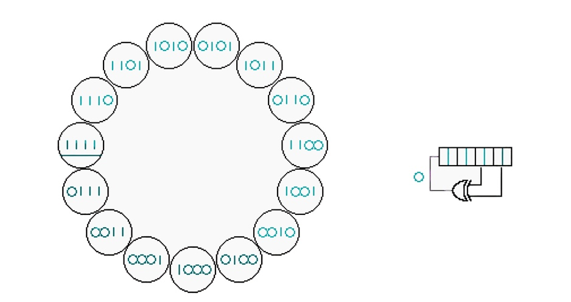

Цель работы:

Получить навыки работы обработки исключений при работе с массивами,
формируемыми в различных режимах. Изучить средства среды
программирования Microsoft Visual Studio Community 2019/2022 для
создания статистических библиотек (файлов формата \*.lib), содержащих
описание ASM-модулей с поддержкой языка С/С++/С\#, и их включения в
основной проект.

# Часть 1.

Задание к лабораторной работе:

На языке Ассемблера реализовать алгоритм преобразования информации с
использованием логических выражений или методов криптографического
преобразования символьной информации в виде отдельной статической
библиотеки. В модуле С/С++ выполнить подключение статистической
библиотеки и вызов ASM- процедуры и обеспечить потоковый ввод/вывод
внешних данных.

Вариант задания, использованный при выполнении практической работы №1
(Вариант №12\*):

Реализовать механизм шифрования и расшифрования битового потока
информации, где ключевая последовательность генерируется линейным
регистром с обратными связями, определяемыми неприводимым полиномом.

Ход работы:

Программа разделена на условные 2 части: шифрование и расшифрование
строки. Строка для шифрования/расшифрования вводится пользователем с
клавиатуры. Ключевая последовательность генерируется с помощью
4-битового регистра сдвига с линейной обратной с отводами от последних 2
битов, которые генерируют новый бит с помощью операции XOR. Поскольку
для определения регистра использовался неприводимый полином, но период
генерируемой им ключевой последовательности максимален и равен
соответственно 2^4^-1=15. Схема работы РСЛОС с перечнем его состояний
представлена на Рисунке 1:

\
*Рисунок 1 -- Схема работы РСЛОС с его состояниям*

Шифрование осуществляется с помощью операции XOR между битами исходной
строки и ключевой последовательностью, сгенерированной РСЛОС. Регистр
генерирует новые биты ключа для каждого бита исходного сообщения.

Расшифровка осуществляется идентично шифрованию, для этого необходимы
лишь зашифрованная строка и начальное состояние РСЛОС, которое
использовалось для шифрования этой же строки.

Листинг кода статической библиотеки на языке Ассемблера и модуля вызова
на языке С представлены в Приложении 1.1 и Приложении 1.2
соответственно.

# Часть 2.

На языке C\# в WindowsForm:

1)  Создать программный проект с защищенным интерфейсом пользователя.
    Обработанные *исключения* фиксировать в textbox ГЛАВНОЙ формы
    проекта и в текстовом файле с указанием даты, времени проявления
    исключений, а также стэка методов, приведших к исключению

2)  Создать программу, выполняющую персональное задание в соответствии с
    заданным вариантом, причем ввод и вывод массивов производить с
    использованием компонента dataGridView. Интерфейс пользователя
    должен предлагать выбор способа формирования массива (случайно,
    случайно с заданной частотой, вручную)

3)  Для обработки массивов использовать несколько потоков.

4)  Выполнить сравнение по времени выполнения обработок массива с и без
    потоков. Время выполнения фиксировать на форме проекта.

5)  Оформить отчет по лабораторной работе, содержащий: титульный лист,
    название, номер и цель работы, постановку задачи, алгоритм решения
    для каждого программного модуля, листинг программных модулей,
    распечатку результатов, распечатку изображения форм, используемых в
    программе.

Задание (Вариант №7):

Из элементов массива *А* (предусмотреть возможность ввода массива
случайно и случайно с заданной частотой) сформировать массив *D* той же
размерности по правилу: первые 10 элементов - *D~i~=A~i~+i,* остальные -
*D~i~=A~i~-i*. Заменить минимальный по модулю положительный элемент
массива *А* нулем. Заменить элементы с *k1*-го по *k2*-й на обратные.

Ход работы:

После запуска программы пользователь видит главную форму проекта,
представленную на Рисунке 2:

\
Рисунок 2 -- Главная форма проекта с вкладками меню

На этой форме фиксируются обработанные исключения, которые могут
возникнуть в ходе использования проекта. Также пользователь может
увидеть сверху вкладки меню, в частности «Технологии и методы
программирования». Кликнув по ней, открывается подменю с выбором
конкретного программного проекта. Со временем перечень вариантов будет
расширяться, на данный момент это «ЛР 1» и «ЛР 2». Демонстрация работы
вкладок меню представлена на Рисунке 3:

\
Рисунок 3 -- Демонстрация работы вкладок меню

После выбора одного из пунктов, на экране открывается новое окно формы,
соответствующее описанию задания для данного проекта. Внешний вид формы,
соответствующей заданию Лабораторной работы №2 представлен на Рисунке 4:

\
*Рисунок 4 -- Внешний вид формы для ЛР 2*

На левой части представлено управление способом формирования массива в
виде трех переключателей со значениями «Вручную», «Случайно» и «Случайно
с заданной частотой». По умолчанию выбран вариант «Вручную». Для
вариантов «Случайно» и «Случайно с заданной частотой» ручной ввод
элементов массива становиться недоступным. Если не выбран пункт
«Случайно с заданной частотой», то поле для ввода значения частоты также
блокируется. программа ожидает от пользователя ввод фамилии и имени с
клавиатуры.

Чуть ниже представлены 2 массива в виде таблиц: исходный и
результирующий, который получается после выполнения алгоритма,
описанного в индивидуальном задании. Также на форме присутствуют кнопка
«Старт» для запуска алгоритма обработки массива, тумблер для
включения/выключения многопоточного режима работы программы, текстовое
поле для вывода времени выполнения алгоритма и кнопка «Доп», при нажатии
на которую раскрывается форма, выполняющая дополнительное задание к
работе.

Чтобы алгоритм обработки исходного массива и формирования
результирующего был выполнен полностью корректно, должны быть заполнены
все активные поля. Если это условие не было выполнено, например не было
введено число k, то программа выполнит часть алгоритма, не требующую
ввода числа k, и отобразит обработанное исключение с указанием даты,
времени проявления исключения, а также стэка методов, приведших к
исключению на главной форме проекта и запишет его в файл
«exceptions.txt», что продемонстрировано на Рисунке 5.

Листинг кода оконного проекта представлен в Приложении 2.

\
*Рисунок 5 -- Фиксация исключения на главной форме и в файле*

# Дополнительное задание.

Задание:

Имеется гистограмма. Разработать алгоритм для вычисления объема воды,
которая сможет удержаться на гистограмме (см. Рисунок 6).
Предполагается, что ширина каждого столбца гистограммы равна 1.

\
*Рисунок 6 -- Пример (черные полосы -- столбцы гистограммы, серые --
вода)*

Ход работы:

Для представленного примера входными данными можно считать высоты
столбцов: {0, 0, 4, 0, 0, 6, 0, 0, 3, 0, 8, 0, 2, 0, 5, 2, 0, 3, 0, 0}.
Выходом работы программы же будем считать нарисованную диаграмму,
корректно заполненную водой и численное значение ее объема, для
представленного примера таковым является: 44.

Можно заметить, что объем воды в конкретной области определяется самыми
высокими столбцами слева и справа. Например, вода заполняет область
между столбцом высотой 6 и столбцом высотой 8 до высоты 6. Таким
образом, высота определяется вторым по размеру столбцом. Общий объем
воды равен сумме объемов у всех столбцов. Соответственно наиболее
эффективным способом вычисления объема воды над каждым столбцом будет
пройти по массиву столбцов и заранее вычислить высоты самых высоких
столбцов слева и справа для каждого индекса. Минимум этих значений
определяет «уровень» воды у столбца. Разность между уровнем воды и
высотой столбца будет определять объем воды.

Таким образом можно составить алгоритм:

1.  Выполнить перебор слева направо с определением максимальной
    обнаруженной высоты и сохранением левого максимума.

2.  Выполнить перебор справа налево с определением максимальной
    обнаруженной высоты и сохранением правого максимума.

3.  Выполнить перебор по гистограмме с вычислением минимума левого и
    правого максимума по каждому индексу.

4\. Выполнить перебор по гистограмме с вычислением разности между каждым
минимумом и высотой столбца. Просуммировать разности.

В реализации хранить столько данных не нужно, а шаги 2, 3 и 4 можно
объединить в один проход. Сначала вычислим левые максимумы за один
проход, а затем выполняем перебор в обратном направлении, вычисляя
правый максимум. Для каждого элемента вычисляется меньшее значение по
левому и правому максимуму и разность между этим значением и высотой
столбца. Полученный результат прибавляется к сумме.

Итоговая алгоритмическая сложность по времени составит O(n), где n --
длина гистограммы. Результат работы алгоритма представлен на Рисунке 7:

*\
Рисунок 7 -- Демонстрация результата выполнения реализованного алгоритма
на входных значениях из примера*

Листинг кода представлен в Приложении 3.

# Выводы:

1.  Получены навыки работы обработки исключений при работе с массивами,
    формируемыми в различных режимах.

2.  Изучены средства среды программирования Microsoft Visual Studio
    Community 2019/2022 для создания статистических библиотек (файлов
    формата \*.lib), содержащих описание ASM-модулей с поддержкой языка
    С/С++/С\#, и их включения в основной проект.

Приложение 1.1 (ASM)

.section \_\_TEXT,\_\_text,regular,pure_instructions

.build_version macos, 12, 0 sdk_version 12, 3

.globl \_LFSR_Fibonacci ; \-- Begin function LFSR_Fibonacci

.p2align 2

\_LFSR_Fibonacci: ; \@LFSR_Fibonacci

.cfi_startproc

; %bb.0:

sub sp, sp, \#16

.cfi_def_cfa_offset 16

str x0, \[sp, \#8\]

ldr x8, \[sp, \#8\]

ldr w9, \[x8\]

ldr x8, \[sp, \#8\]

ldr w8, \[x8\]

eor w8, w8, w9, lsr \#1

and w9, w8, \#0x1

ldr x8, \[sp, \#8\]

ldr w8, \[x8\]

lsr w8, w8, \#1

orr w8, w8, w9, lsl \#3

ldr x9, \[sp, \#8\]

str w8, \[x9\]

ldr x8, \[sp, \#8\]

ldr w8, \[x8\]

and w0, w8, \#0x1

add sp, sp, \#16

ret

.cfi_endproc

; \-- End function

.globl \_my_enc ; \-- Begin function my_enc

.p2align 2

\_my_enc: ; \@my_enc

.cfi_startproc

; %bb.0:

sub sp, sp, \#96

stp x29, x30, \[sp, \#80\] ; 16-byte Folded Spill

add x29, sp, \#80

.cfi_def_cfa w29, 16

.cfi_offset w30, -8

.cfi_offset w29, -16

stur x0, \[x29, \#-8\]

stur w1, \[x29, \#-12\]

stur x2, \[x29, \#-24\]

adrp x0, l\_.str\@PAGE

add x0, x0, l\_.str\@PAGEOFF

bl \_printf

ldur x0, \[x29, \#-24\]

mov x1, \#1

bl \_calloc

stur x0, \[x29, \#-32\]

stur wzr, \[x29, \#-36\]

b LBB1_1

LBB1_1: ; =\>This Loop Header: Depth=1

; Child Loop BB1_3 Depth 2

ldursw x8, \[x29, \#-36\]

ldur x9, \[x29, \#-24\]

subs x8, x8, x9

b.hs LBB1_8

b LBB1_2

LBB1_2: ; in Loop: Header=BB1_1 Depth=1

str wzr, \[sp, \#40\]

mov w8, \#7

str w8, \[sp, \#36\]

b LBB1_3

LBB1_3: ; Parent Loop BB1_1 Depth=1

; =\> This Inner Loop Header: Depth=2

ldr w8, \[sp, \#36\]

tbnz w8, \#31, LBB1_6

b LBB1_4

LBB1_4: ; in Loop: Header=BB1_3 Depth=2

sub x0, x29, \#12

bl \_LFSR_Fibonacci

and w8, w0, \#0x1

str w8, \[sp, \#32\]

ldr w9, \[sp, \#40\]

ldr w8, \[sp, \#32\]

ldur x10, \[x29, \#-8\]

ldursw x11, \[x29, \#-36\]

ldrsb w10, \[x10, x11\]

ldr w11, \[sp, \#36\]

asr w10, w10, w11

and w10, w10, \#0x1

eor w8, w8, w10

orr w8, w8, w9, lsl \#1

str w8, \[sp, \#40\]

ldr w8, \[sp, \#40\]

; implicit-def: \$x12

mov x12, x8

ldr w8, \[sp, \#32\]

; implicit-def: \$x10

mov x10, x8

ldur x8, \[x29, \#-8\]

ldursw x9, \[x29, \#-36\]

ldrsb w11, \[x8, x9\]

ldr w9, \[sp, \#36\]

; implicit-def: \$x8

mov x8, x9

mov x9, sp

str x12, \[x9\]

str x10, \[x9, \#8\]

; implicit-def: \$x10

mov x10, x11

str x10, \[x9, \#16\]

str x8, \[x9, \#24\]

adrp x0, l\_.str.1\@PAGE

add x0, x0, l\_.str.1\@PAGEOFF

bl \_printf

b LBB1_5

LBB1_5: ; in Loop: Header=BB1_3 Depth=2

ldr w8, \[sp, \#36\]

subs w8, w8, \#1

str w8, \[sp, \#36\]

b LBB1_3

LBB1_6: ; in Loop: Header=BB1_1 Depth=1

ldr w8, \[sp, \#40\]

ldur x9, \[x29, \#-32\]

ldursw x10, \[x29, \#-36\]

strb w8, \[x9, x10\]

ldur x8, \[x29, \#-8\]

ldursw x9, \[x29, \#-36\]

ldrsb w13, \[x8, x9\]

ldur x8, \[x29, \#-8\]

ldursw x9, \[x29, \#-36\]

ldrsb w12, \[x8, x9\]

ldur x8, \[x29, \#-32\]

ldursw x9, \[x29, \#-36\]

ldrb w11, \[x8, x9\]

ldur x8, \[x29, \#-32\]

ldursw x9, \[x29, \#-36\]

ldrb w10, \[x8, x9\]

mov x9, sp

; implicit-def: \$x8

mov x8, x13

str x8, \[x9\]

; implicit-def: \$x8

mov x8, x12

str x8, \[x9, \#8\]

; implicit-def: \$x8

mov x8, x11

str x8, \[x9, \#16\]

; implicit-def: \$x8

mov x8, x10

str x8, \[x9, \#24\]

adrp x0, l\_.str.2\@PAGE

add x0, x0, l\_.str.2\@PAGEOFF

bl \_printf

b LBB1_7

LBB1_7: ; in Loop: Header=BB1_1 Depth=1

ldur w8, \[x29, \#-36\]

add w8, w8, \#1

stur w8, \[x29, \#-36\]

b LBB1_1

LBB1_8:

ldur x8, \[x29, \#-32\]

ldur x9, \[x29, \#-24\]

add x8, x8, x9

strb wzr, \[x8\]

ldur x10, \[x29, \#-8\]

ldur x8, \[x29, \#-32\]

mov x9, sp

str x10, \[x9\]

str x8, \[x9, \#8\]

adrp x0, l\_.str.3\@PAGE

add x0, x0, l\_.str.3\@PAGEOFF

bl \_printf

ldur x0, \[x29, \#-32\]

ldp x29, x30, \[sp, \#80\] ; 16-byte Folded Reload

add sp, sp, \#96

ret

.cfi_endproc

; \-- End function

.globl \_my_dec ; \-- Begin function my_dec

.p2align 2

\_my_dec: ; \@my_dec

.cfi_startproc

; %bb.0:

sub sp, sp, \#96

stp x29, x30, \[sp, \#80\] ; 16-byte Folded Spill

add x29, sp, \#80

.cfi_def_cfa w29, 16

.cfi_offset w30, -8

.cfi_offset w29, -16

stur x0, \[x29, \#-8\]

stur w1, \[x29, \#-12\]

stur x2, \[x29, \#-24\]

adrp x0, l\_.str.4\@PAGE

add x0, x0, l\_.str.4\@PAGEOFF

bl \_printf

ldur x0, \[x29, \#-24\]

mov x1, \#1

bl \_calloc

stur x0, \[x29, \#-32\]

stur wzr, \[x29, \#-36\]

b LBB2_1

LBB2_1: ; =\>This Loop Header: Depth=1

; Child Loop BB2_3 Depth 2

ldursw x8, \[x29, \#-36\]

ldur x9, \[x29, \#-24\]

subs x8, x8, x9

b.hs LBB2_8

b LBB2_2

LBB2_2: ; in Loop: Header=BB2_1 Depth=1

str wzr, \[sp, \#40\]

mov w8, \#7

str w8, \[sp, \#36\]

b LBB2_3

LBB2_3: ; Parent Loop BB2_1 Depth=1

; =\> This Inner Loop Header: Depth=2

ldr w8, \[sp, \#36\]

tbnz w8, \#31, LBB2_6

b LBB2_4

LBB2_4: ; in Loop: Header=BB2_3 Depth=2

sub x0, x29, \#12

bl \_LFSR_Fibonacci

and w8, w0, \#0x1

str w8, \[sp, \#32\]

ldr w9, \[sp, \#40\]

ldr w8, \[sp, \#32\]

ldur x10, \[x29, \#-8\]

ldursw x11, \[x29, \#-36\]

ldrb w10, \[x10, x11\]

ldr w11, \[sp, \#36\]

asr w10, w10, w11

and w10, w10, \#0x1

eor w8, w8, w10

orr w8, w8, w9, lsl \#1

str w8, \[sp, \#40\]

ldr w8, \[sp, \#40\]

; implicit-def: \$x12

mov x12, x8

ldr w8, \[sp, \#32\]

; implicit-def: \$x10

mov x10, x8

ldur x8, \[x29, \#-8\]

ldursw x9, \[x29, \#-36\]

ldrb w11, \[x8, x9\]

ldr w9, \[sp, \#36\]

; implicit-def: \$x8

mov x8, x9

mov x9, sp

str x12, \[x9\]

str x10, \[x9, \#8\]

; implicit-def: \$x10

mov x10, x11

str x10, \[x9, \#16\]

str x8, \[x9, \#24\]

adrp x0, l\_.str.1\@PAGE

add x0, x0, l\_.str.1\@PAGEOFF

bl \_printf

b LBB2_5

LBB2_5: ; in Loop: Header=BB2_3 Depth=2

ldr w8, \[sp, \#36\]

subs w8, w8, \#1

str w8, \[sp, \#36\]

b LBB2_3

LBB2_6: ; in Loop: Header=BB2_1 Depth=1

ldr w8, \[sp, \#40\]

ldur x9, \[x29, \#-32\]

ldursw x10, \[x29, \#-36\]

strb w8, \[x9, x10\]

ldur x8, \[x29, \#-8\]

ldursw x9, \[x29, \#-36\]

ldrb w13, \[x8, x9\]

ldur x8, \[x29, \#-8\]

ldursw x9, \[x29, \#-36\]

ldrb w12, \[x8, x9\]

ldur x8, \[x29, \#-32\]

ldursw x9, \[x29, \#-36\]

ldrb w11, \[x8, x9\]

ldur x8, \[x29, \#-32\]

ldursw x9, \[x29, \#-36\]

ldrb w10, \[x8, x9\]

mov x9, sp

; implicit-def: \$x8

mov x8, x13

str x8, \[x9\]

; implicit-def: \$x8

mov x8, x12

str x8, \[x9, \#8\]

; implicit-def: \$x8

mov x8, x11

str x8, \[x9, \#16\]

; implicit-def: \$x8

mov x8, x10

str x8, \[x9, \#24\]

adrp x0, l\_.str.2\@PAGE

add x0, x0, l\_.str.2\@PAGEOFF

bl \_printf

b LBB2_7

LBB2_7: ; in Loop: Header=BB2_1 Depth=1

ldur w8, \[x29, \#-36\]

add w8, w8, \#1

stur w8, \[x29, \#-36\]

b LBB2_1

LBB2_8:

ldur x8, \[x29, \#-32\]

ldur x9, \[x29, \#-24\]

add x8, x8, x9

strb wzr, \[x8\]

ldur x10, \[x29, \#-8\]

ldur x8, \[x29, \#-32\]

mov x9, sp

str x10, \[x9\]

str x8, \[x9, \#8\]

adrp x0, l\_.str.3\@PAGE

add x0, x0, l\_.str.3\@PAGEOFF

bl \_printf

ldur x0, \[x29, \#-32\]

ldp x29, x30, \[sp, \#80\] ; 16-byte Folded Reload

add sp, sp, \#96

ret

.cfi_endproc

; \-- End function

.section \_\_TEXT,\_\_cstring,cstring_literals

l\_.str: ; @.str

.asciz
\"\-\-\-\--\\320\\250\\320\\270\\321\\204\\321\\200\\321\\203\\320\\265\\320\\274\-\-\-\--\\n\"

l\_.str.1: ; @.str.1

.asciz \"%x = %x \^ (%x \>\> %d) & 0x01)\\n\"

l\_.str.2: ; @.str.2

.asciz \"%x (%c) -\> %x (%c)\\n\"

l\_.str.3: ; @.str.3

.asciz \"%s -\> %s\\n\\n\\n\"

l\_.str.4: ; @.str.4

.asciz
\"\-\-\-\--\\320\\240\\320\\260\\321\\201\\321\\210\\320\\270\\321\\204\\321\\200\\320\\276\\320\\262\\321\\213\\320\\262\\320\\260\\320\\265\\320\\274\-\-\-\--\\n\"

.subsections_via_symbols

Приложение 1.2 (C)

\#include \<stdio.h\>

\#include \<stdlib.h\>

\#include \<string.h\>

**extern** **unsigned** **char**\* my_enc();

**extern** **unsigned** **char**\* my_dec();

**int** main() {

**register** **unsigned** **int** initial_state = 0xF;

**char** message\[128\];

printf(\"Enter a string: \");

scanf(\"%s\", message);

size_t size = strlen(message)+1;

**unsigned** **char**\* e = my_enc(message, initial_state, size);

**unsigned** **char**\* d = my_dec(e, initial_state, size);

free(e);

free(d);

}

Приложение 2 (Основное задание)

**import** time\
**import** tkinter **as** tk\
**import** random\
**import** traceback\
\
root = tk.Tk()\
root.grid_columnconfigure(0, weight=1)\
lbl_exceptions = tk.Label(root, background=**\"white\"**, width=90,
height=20, anchor=**\"w\"**, justify=**\"left\"**)\
lbl_exceptions.grid(row=0, column=0, columnspan=5, sticky=**\'ew\'**)\
\
\
**def** show_error(self, \*args):\
**from** datetime **import** datetime\
err = traceback.format_exception(\*args)\
now = datetime.now()\
dt_string = now.strftime(**\"%d.%m.%Y - %H:%M:%S\"**)\
text = dt_string + **\"\\n\"\
for** e **in** err:\
text += e + **\"\\n\"\
**lbl_exceptions.config(text=text)\
\
fp = open(**\'exceptions.txt\'**, **\'a\'**)\
fp.write(text)\
fp.close()*\
\
\
*tk.Tk.report_callback_exception = show_error\
\
\
**def** lab2_btn():\
window = tk.Toplevel(root)\
window.title(**\"Виндоус Форма\"**)\
window.geometry(**\"780x330+5+400\"**)\
*\
***def** sel():\
**match** int(var.get()):\
**case** 1:\
**for** entry **in** ins:\
entry.config(state=**\'normal\'**)\
ent_frequency.config(state=**\'disabled\'**)\
**case** 2:\
**for** entry **in** ins:\
entry.config(state=**\'disabled\'**)\
ent_frequency.config(state=**\'disabled\'**)\
**case** 3:\
**for** entry **in** ins:\
entry.config(state=**\'disabled\'**)\
ent_frequency.config(state=**\'normal\'**)\
\
lbl_count = tk.Label(window, text=**\"Выберите способ формирования
массива:\"**)\
lbl_count.grid(row=0, column=0, columnspan=10, sticky=**\"w\"**)\
\
var = tk.IntVar()\
R1 = tk.Radiobutton(window, text=**\"Вручную\"**, variable=var, value=1,
command=sel)\
R1.select()\
R1.grid(row=1, column=0, columnspan=10, sticky=**\"w\"**)\
\
R2 = tk.Radiobutton(window, text=**\"Случайно\"**, variable=var,
value=2, command=sel)\
R2.grid(row=2, column=0, columnspan=10, sticky=**\"w\"**)\
\
R3 = tk.Radiobutton(window, text=**\"Случайно с заданной частотой\"**,
variable=var, value=3, command=sel)\
R3.grid(row=3, column=0, columnspan=10, sticky=**\"w\"**)\
*\
*lbl_k = tk.Label(window, text=**\"Введиите число k:\"**)\
ent_k = tk.Entry(window, width=13)\
lbl_k.grid(row=1, column=11, columnspan=5, sticky=**\"w\"**)\
ent_k.grid(row=2, column=11, columnspan=5, sticky=**\"w\"**)\
*\
*lbl_frequency = tk.Label(window, text=**\"Частота:\"**)\
ent_frequency = tk.Entry(window, width=13, state=**\"disabled\"**)\
lbl_frequency.grid(row=1, column=16, columnspan=5, sticky=**\"w\"**)\
ent_frequency.grid(row=2, column=16, columnspan=5, sticky=**\"w\"**)\
\
**def** alg():\
mine = tk.Entry(textvariable=tk.IntVar(value=100))\
**if** int(var.get()) == 2:\
**for** entry **in** ins:\
tmp = random.randint(1, 99)\
entry.config(textvariable=tk.IntVar(value=tmp))\
**if** tmp \< int(mine.get()):\
mine = entry\
**if** int(var.get()) == 3:\
**for** entry **in** ins:\
tmp = random.randint(1, int(ent_frequency.get()))\
entry.config(textvariable=tk.IntVar(value=tmp))\
**if** tmp \< int(mine.get()):\
mine = entry\
\
start = time.time() \* 1000000\
**if** int(check_var1.get()) == 0:\
count = 0\
**for** entry **in** outs:\
**if** count \< 10:\
entry.config(text=int(search(count)) + count)\
**else**:\
entry.config(text=int(search(count)) - count)\
count += 1\
\
**def** zer():\
mine.config(textvariable=tk.IntVar(value=0))\
\
window.after(5000, zer)\
time.sleep(5)\
\
**def** repl():\
count = 0\
tmp = int()\
**for** entry **in** outs:\
**if** int(ent_k.get()) == count:\
tmp = entry.cget(**\"text\"**)\
entry.config(textvariable=tk.IntVar(value=int(search(int(ent_k.get())))))\
**break\
else**:\
count += 1\
count = 0\
**for** entry **in** ins:\
**if** int(ent_k.get()) == count:\
entry.config(textvariable=tk.IntVar(value=tmp))\
**break\
else**:\
count += 1\
\
window.after(7500, repl)\
time.sleep(2.5)\
**elif** int(check_var1.get()) == 1:\
**from** threading **import** Thread\
**def** for_first():\
count = 0\
**for** entry **in** outs:\
**if** count \< 10:\
entry.config(text=int(search(count)) + count)\
count += 1\
**else**:\
**break\
\
def** zer():\
mine.config(textvariable=tk.IntVar(value=0))\
\
window.after(5000, zer)\
time.sleep(5)\
\
**def** for_second():\
count = len(outs) - 1\
**for** entry **in** reversed(outs):\
**if** count \>= 10:\
entry.config(text=int(search(count)) - count)\
count -= 1\
**else**:\
**break\
\
def** repl():\
count = 0\
tmp = int()\
**for** entry **in** outs:\
**if** int(ent_k.get()) == count:\
tmp = entry.cget(**\"text\"**)\
entry.config(textvariable=tk.IntVar(value=int(search(int(ent_k.get())))))\
**break\
else**:\
count += 1\
count = 0\
**for** entry **in** ins:\
**if** int(ent_k.get()) == count:\
entry.config(textvariable=tk.IntVar(value=tmp))\
**break\
else**:\
count += 1\
\
window.after(7500, repl)\
time.sleep(2.5)\
\
th1 = Thread(target=for_first, args=())\
th2 = Thread(target=for_second, args=())\
th1.start()\
th2.start()*\
*end = time.time() \* 1000000 - start\
**if** end \> 1000:\
**if** end \> 10000:\
**if** end \> 10000000:\
txttime = **\"runtime: {:0.2f} seconds\"**.format(end / 10000000)\
**else**:\
txttime = **\"runtime: {:0.2f} milliseconds\"**.format(end / 10000)\
**else**:\
txttime = **\"runtime: {:0.2f} microseconds\"**.format(end / 1000)\
**else**:\
txttime = **\"runtime: {:0.2f} nanoseconds\"**.format(end)*\
*lbl_time.config(text=txttime)\
\
**def** search(i):\
count = 0\
**for** entry **in** ins:\
**if** i == count:\
**return** entry.get()\
**else**:\
count += 1\
\
ins = \[\]\
btn_length = tk.Button(window, text=**\"Старт\"**, command=alg,
width=10)\
btn_length.grid(row=5, column=11, columnspan=5, sticky=**\"w\"**)\
\
btn_length = tk.Button(window, text=**\"Доп\"**, command=dop, width=10)\
btn_length.grid(row=5, column=16, columnspan=5, sticky=**\"w\"**)\
\
lbl_initm = tk.Label(window, text=**\"Исходный массив:\"**)\
lbl_initm.grid(row=5, column=0, columnspan=5, sticky=**\"w\"**)\
\
check_var1 = tk.IntVar()\
C1 = tk.Checkbutton(window, text=**\"Многопоточность\"**,
variable=check_var1, onvalue=1, offvalue=0, height=5, width=15)\
C1.grid(row=5, column=6, columnspan=5, sticky=**\"w\"**)\
\
**for** x **in** range(20):\
text = tk.Label(window, width=3, text=x, background=**\"white\"**)\
text.grid(row=6, column=x)\
inp = tk.Entry(window, width=3)\
inp.grid(row=7, column=x)\
ins.append(inp)\
\
lbl_resm = tk.Label(window, text=**\"Результирующий массив:\"**)\
lbl_resm.grid(row=9, column=0, columnspan=5, sticky=**\"w\"**)*\
\
*outs = \[\]\
**for** x **in** range(20):\
text = tk.Label(window, width=3, text=x, background=**\"white\"**)\
text.grid(row=11, column=x)\
outp = tk.Label(window, width=3, background=**\"white\"**)\
outp.grid(row=12, column=x, pady=(3, 0))\
outs.append(outp)\
\
lbl_time = tk.Label(window, text=**\"Время выполнения\"**)\
lbl_time.grid(row=13, column=0, columnspan=5, sticky=**\"w\"**)\
\
window.mainloop()\
\
\
**def** donothing():\
filewin = tk.Toplevel(root)\
lbl_nothing = tk.Label(filewin, text=**\"There is nothing to see
here\"**, padx=100, pady=100)\
lbl_nothing.pack()\
\
\
**def** about_btn():\
**from** PIL **import** ImageTk, Image\
\
filewin = tk.Toplevel(root)\
img = ImageTk.PhotoImage(Image.open(**\"me.png\"**))\
about_photo_lbl = tk.Label(filewin, image=img)\
about_photo_lbl.grid(row=0)\
\
about_name_lbl = tk.Label(filewin, text=**\"Vadim Dmitriev\"**,
font=**\'Helvetica 18 bold\'**)\
about_name_lbl.grid(row=1)\
\
about_description_lbl = tk.Label(filewin, text=**\"I spent an hour on
this screen\"**)\
about_description_lbl.grid(row=2)\
\
about_description_lbl = tk.Label(filewin, text=**\"(c) 2022-2022 State
University of Aerospace Instrumentation.\"**)\
about_description_lbl.grid(row=3)\
\
filewin.mainloop()\
\
\
menubar = tk.Menu(root)\
filemenu = tk.Menu(menubar, tearoff=0)\
filemenu.add_command(label=**\"ЛР 1\"**, command=donothing)\
filemenu.add_command(label=**\"ЛР 2\"**, command=lab2_btn)\
filemenu.add_separator()\
filemenu.add_command(label=**\"Exit\"**, command=root.destroy)\
menubar.add_cascade(label=**\"Технологии и методы программирования\"**,
menu=filemenu)\
\
helpmenu = tk.Menu(menubar, tearoff=0)\
helpmenu.add_command(label=**\"About\...\"**, command=about_btn)\
menubar.add_cascade(label=**\"Help\"**, menu=helpmenu)\
\
root.config(menu=menubar)\
\
root.mainloop()

Приложение 3 (Дополнительное задание)

**def** dop():*\
*window2 = tk.Toplevel(window)\
window2.title(**\"Задача про гистограмму с водой\"**)\
window2.geometry(**\"500x330+825+400\"**)*\
***import** matplotlib

matplotlib.use(**\'TkAgg\'**)\
**from** matplotlib.figure **import** Figure\
**from** matplotlib.backends.backend_tkagg **import** (\
FigureCanvasTkAgg,\
NavigationToolbar2Tk\
)\
\
**class** App(tk.Tk):

**def** \_\_init\_\_(self):*\
*histo = \[\]\
**for** entry **in** ins:\
histo.append(int(entry.get()))\
left_maxes = histo.copy()\
left_max = histo\[0\]\
**for** i **in** range(len(histo)):\
left_max = max(left_max, histo\[i\])\
left_maxes\[i\] = left_max\
\
sum = 0\
water = \[0\] \* len(histo)

*\
*figure = Figure(figsize=(6, 4), dpi=100)*\
*figure_canvas = FigureCanvasTkAgg(figure, master=window2)\
figure_canvas.get_tk_widget().pack(side=tk.TOP, fill=tk.BOTH, expand=1)\
*\
*axes = figure.add_subplot()\
axes.bar(\[x **for** x **in** range(0, 20)\], histo,
label=**\'Столбцы\'**, color=**\"black\"**)\
axes.bar(\[x **for** x **in** range(0, 20)\], water, bottom=histo,
label=**\'Вода\'**, color=**\"lightblue\"**)\
\
right_max = histo\[len(histo) - 1\]\
**for** i **in** range(len(histo) - 1, 0, -1):\
right_max = max(right_max, histo\[i\])\
second_tallest = min(right_max, left_maxes\[i\])\
**if** second_tallest \> histo\[i\]:\
water\[i\] = second_tallest - histo\[i\]\
sum += water\[i\]\
print(sum)\
\
**def** draw_water():\
figure.clear()\
axes = figure.add_subplot()\
axes.bar(\[x **for** x **in** range(0, 20)\], histo,
label=**\'Столбцы\'**, color=**\"black\"**)\
axes.bar(\[x **for** x **in** range(0, 20)\], water, bottom=histo,
label=**\'Вода\'**, color=**\"lightblue\"**)\
figure_canvas.draw_idle()\
\
window2.after(3000, draw_water)\
\
**if** \_\_name\_\_ == **\'\_\_main\_\_\'**:\
app = App()\
app.mainloop()
