Цель работы:

Рассмотреть понятие рекурсии, научиться проводить анализ рекурсивных
алгоритмов и состояние стека при выполнении рекурсий. Изучить свойства и
методы классов для растровой графики. Сформировать регулярные
фрактальные объекты и сигналы Фурье.

# Часть 1.

Задание к лабораторной работе:

Разработать программный редактор графических изображений, способный

- создавать/открывать/сохранять/редактировать масштабируемое растровое
  изображение;

- использовать средства выбора параметров отрисовки (ширина/тип линии,
  способ отрисовки, цвет линии/фона/заливки);

- отображать «живые» сигналы Фурье с
  прямоугольной/треугольной/пилообразной/ формой огибающей гармоник;

- предусматривать эффективное использование системных ресурсов,

- изображение должно автоматически перерисовываться при изменении
  размеров форм, их закрытии и свертывании.

Ход работы:

Программа разделена на условные 2 части: собственно, сам графический
редактор изображений с возможностью создания, открытия, сохранения и
редактирования изображений и изменением параметров отрисовки, таких как:
ширина и цвет линии; и модуль для отображения и настройки «живых»
сигналов Фурье с прямоугольной, треугольной и пилообразной формами
огибающих гармоник.

Рассмотрим подробнее графический редактор изображений, интерфейс
которого представлен на Рисунке 1:

  
*Рисунок 1 – Интерфейс программного редактора графических изображений*

Управление осуществляется с помощью двух рядов управляющих кнопок, с
помощью которых можно регулировать цвет и толщину линии, а также
открывать уже готовые изображения для их последующего редактирования с
помощью кнопки «Открыть» и сохранять получившийся результат с помощью
соответствующей кнопки «Сохранить». Процесс редактирования изображения,
загруженного с помощью кнопки «Открыть» и последующего его сохранения
представлен на Рисунке 2:

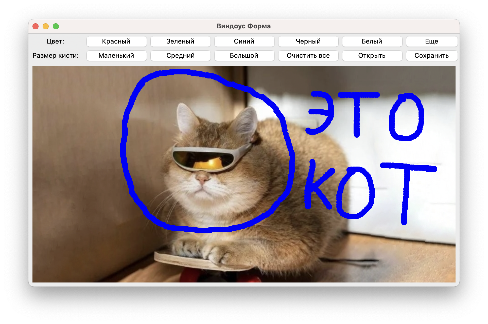  
*Рисунок 2 – Интерфейс редактора во время работы*

С помощью кнопки «Еще» пользователь попадает в меню выбора
дополнительных подмодулей программы, с такими условными названиями как:
«"живые" сигналы Фурье», «Рекурсия» «Пифагор», «Серпинский» и «Доп».
Подробнее в этой части отчета рассмотрим модуль «"живые" сигналы Фурье»,
его интерфейс представлен на Рисунке 3:

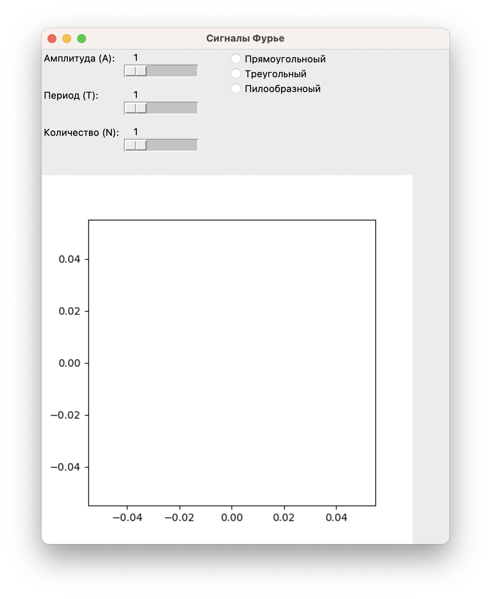*Рисунок
3 – Интерфейс модуля* «"живые" сигналы Фурье»

С помощью трех слайдеров, отмечающих непосредственно за значение
параметров амплитуды, периоды и количества составляющих в формуле, и
трех радиобатонов, с помощью которых выбирается вид огибающей, в
реальном времени производится смена параметров сигнала Фурье, огибающая
которого выводится в область графика под управляющими элементами.

В масштабе графика умещается 100 условных единиц по горизонтали, а по
вертикали шкала подстраивается под заданное пользователем значение
амплитуда. Целесообразно использовать значение 20…80 для периода
выводимого графика и максимальное число составляющих N для наиболее
четких контуров. Интерфейс программного модуля для пилообразной
огибающей с параметрами А=1, Т=33, N=100 представлена на рисунке 4:

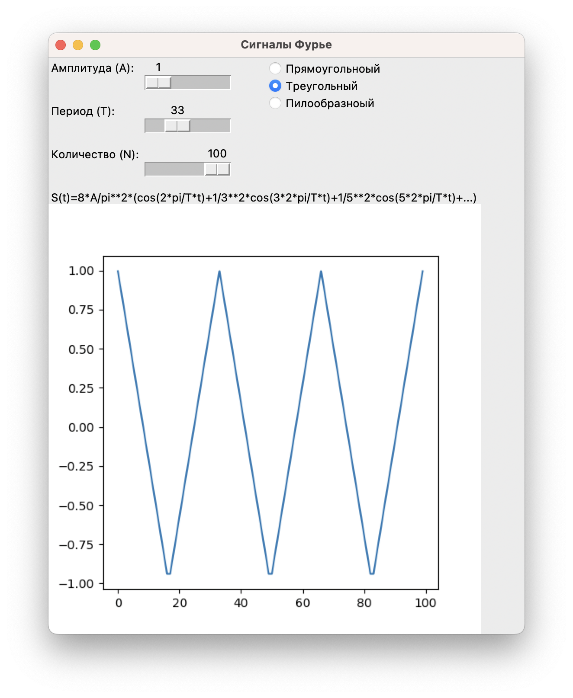  
*Рисунок 4 – Интерфейс модуля* «"живые" сигналы Фурье» в процессе работы

# 

# Часть 2.

1)  Создать программу, отрисовывающую регулярные фракталы дерева
    Пифагора и салфетки Серпинского. Число рекурсивных вызовов
    изменяется пользователем и автоматически перерисовывает фрактал.
    Заливка фигуры должна меняться градиентно на каждой рекурсивной
    итерации (Использовать асинхронный режим работы).

2)  Создать программу, демонстрирующую работу рекурсивного алгоритма в
    соответствии с заданным вариантом. Алгоритм представлен в
    лексографическом виде.

3)  Программа должна представить результат в графическом виде (для
    текстовых рекурсий в том числе).

4)  Для координатных осей (в вариантах с графиками функций) должны
    отражаться засечки отсчетов с указанием значений.

Задание (Вариант №7):

Реализовать рекурсивный алгоритм определения суммы членов арифметической
прогрессии. При расчете суммы членов прогрессии использовать функции из
варианта 4.

**алг вещ** Сумма арифм (**арг вещ** а1, д, **цел** н)

**нач**

> **если** н=1 **то знач**:=а1
>
> **иначе знач** :=Сумма арифм (а1, д, н-1) + Член арифм (а1, д, н)
>
> **все**

**кон**

Рекурсивный алгоритм вычисления членов арифметической прогрессии из
варианта 4:

**алг вещ** Член арифм (**арг вещ** а1, д, **цел** н)

**нач**

> **если** н=1 **то знач** :=а1
>
> **иначе знач** := Член арифм (а1, д, н-1) + д
>
> **все**

**кон**

Ход работы:

Переход к выполненным заданиям второй части лабораторной работы
происходит с помощью специального навигационного меню, представленного
на Рисунке 5:

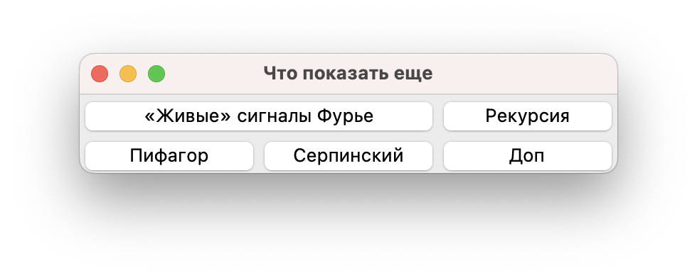  
*Рисунок 5 – Навигационного меню*

Пункту 1) второй части задания лабораторной работы соответствуют модули,
которые вызываются при нажатии на управляющие кнопки «Пифагор» и
«Серпинский». Рассмотрим, сначала модуль под условным названием
«Пифагор», интерфейс которого представлен на Рисунке 6:

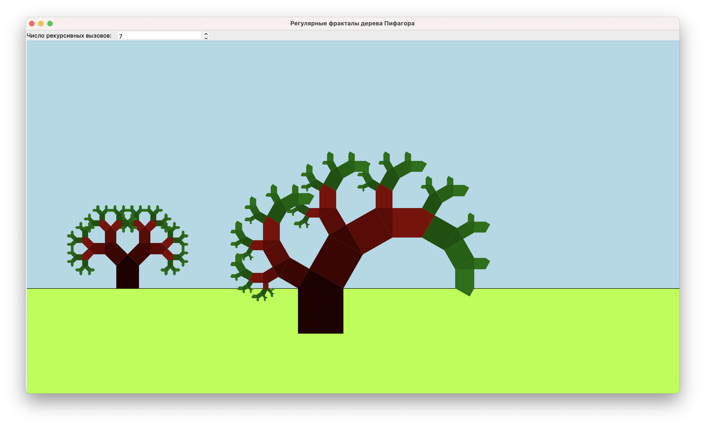  
*Рисунок 6 – Модуль «Пифагор» в работе*

Суть работы данного модуля заключается в отрисовывке на экране
пользователя двух регулярных фракталов дерева Пифагора: стандартного и с
«ветром». Число рекурсивных вызовов изменяется пользователем и
автоматически перерисовывает фрактал. Заливка фигуры меняться в
зависимости от номера рекурсивной итерации.

Суть работы модуля «Серпинский» идентична описанию для предыдущего
модуля с отличием лишь в виде регулярного фрактала — здесь это салфетка
Серпинского. Интерфейс этого модуля представлен на Рисунке 7:

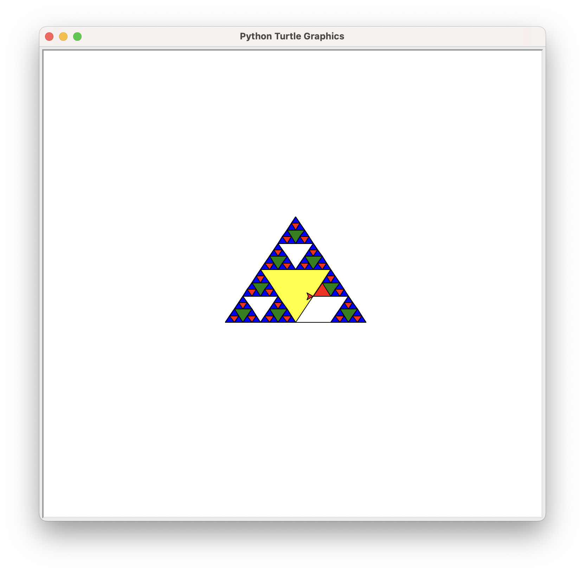  
*Рисунок 7 – Модуль «Серпинский» в работе*

Следующий пункт задания — создание программы, демонстрирующей работу
рекурсивного алгоритма, описанного в варианте 7. За этот пункт отвечает
модуль с условным названием «Рекурсия», его интерфейс во время работы
изображен на Рисунке 8:

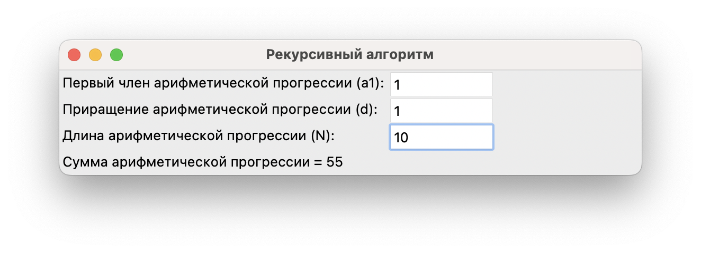  
*Рисунок 8 – Модуль «Рекурсия» в работе*

От пользователя ожидается ввод инициализирующих значений в
соответствующих окнах формы, после чего происходит выполнение алгоритма
в соответствии с вариантом.

# Дополнительное задание.

Задание:

Реализовать игру «Вордли».

Ход работы:

Вордли — это русскоязычный аналог нашумевшей игры Wordle, словесная
головоломка, где нужно за 6 попыток угадать слово. После каждой попытки
буквы введенного слова подсвечиваются определенным цветом:

- 🟨 желтым — если буква есть в загаданном слове, но стоит в
  неправильном месте

- 🟩 зеленым — если буква есть в загаданном слове, и вы правильно
  определили ее позицию

- ⬜ серым — если такой буквы нет в загаданном слове.

Благодаря простым правилам в игру Вордли она обрела огромную
популярность в России и в мире в 2021 году.

Сразу после запуска модуля «Доп», то есть в самом начале игры,
пользователь видит лишь одно пустое поле, приглашающее ввести первое
слово, и кнопку «Угадать», которая отправляет слово на проверку и
уменьшает на один количество оставшихся попыток. Интерфейс модуля в
начале игры представлен на Рисунке 9:

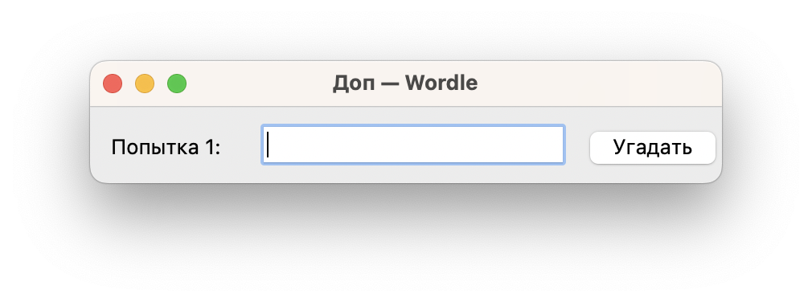  
*Рисунок 9 – Модуль «Доп» сразу после запуска*

После ввода первой попытки в окне формы отображается результат в
соответствии с правилами игры, описанными выше. Пример интерфейса
программы после ввода первого слова представлен на Рисунке 10:

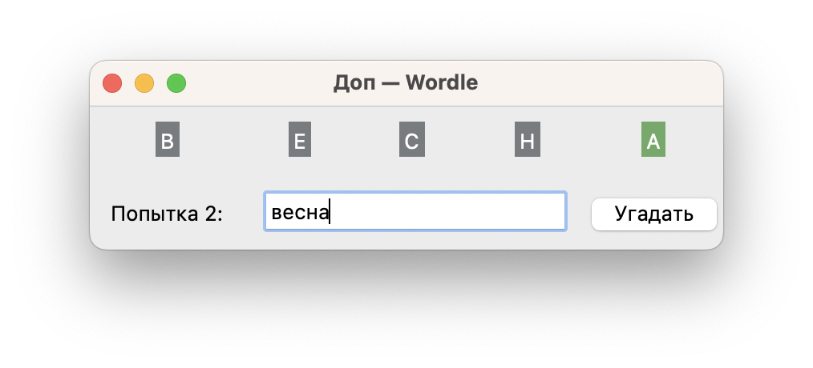  
*Рисунок 10 – Модуль «Доп» после ввода первого слова*

В примере на рисунке загадано слово «ЧАЛКА» (выбрано случайно из
словаря), а в качестве первой попытки введено «ВЕСНА». У этих слов
совпадает лишь последняя буква, поэтому буква «А» на форме раскрашена в
зеленый цвет, что означает, что она есть в загаданном слове и стоит на
правильном месте.

Предусмотрена защита «от дурака», которая контролирует ввод только
5-буквенных слов в форму. Иначе пользователь видит диалоговое окно,
представленное на рисунке 11:

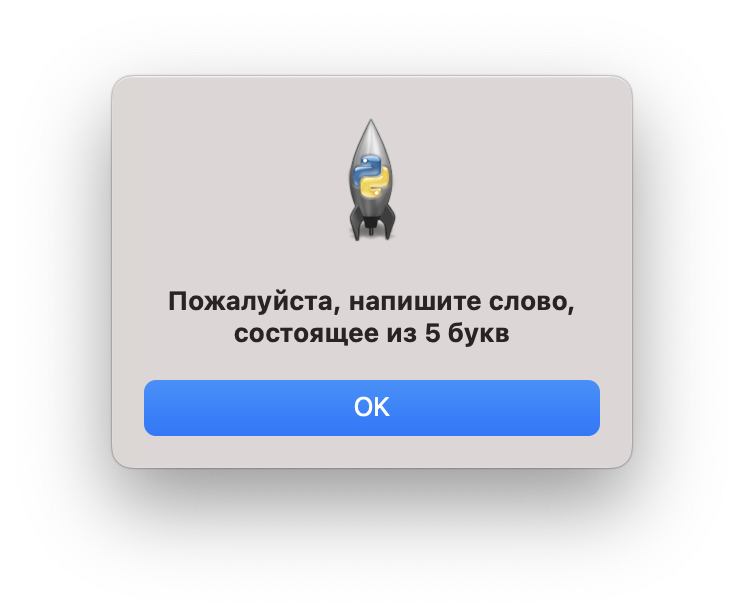  
*Рисунок 11 – Диалоговое окно при неверной длине вводимого слова*

Если пользователь ввел загаданное слово, то он так же видит диалоговое
окно, сообщающее ему о победе, оно представлено на Рисунке 12:

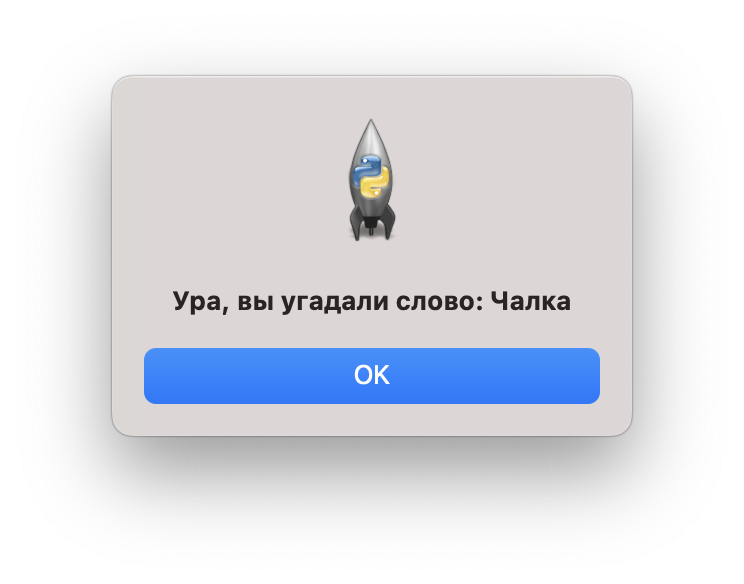  
*Рисунок 12 – Диалоговое окно при вводе загаданного слова*

В случае же проигрыша выводится окно с соответствующим сообщением и
загаданным словом, представленное на рисунке 13:

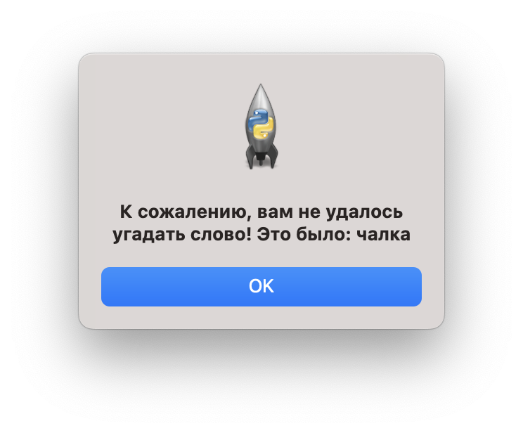  
*Рисунок 13 – Диалоговое окно при проигрыше*
