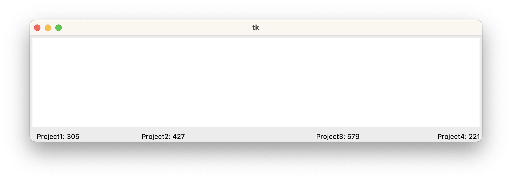
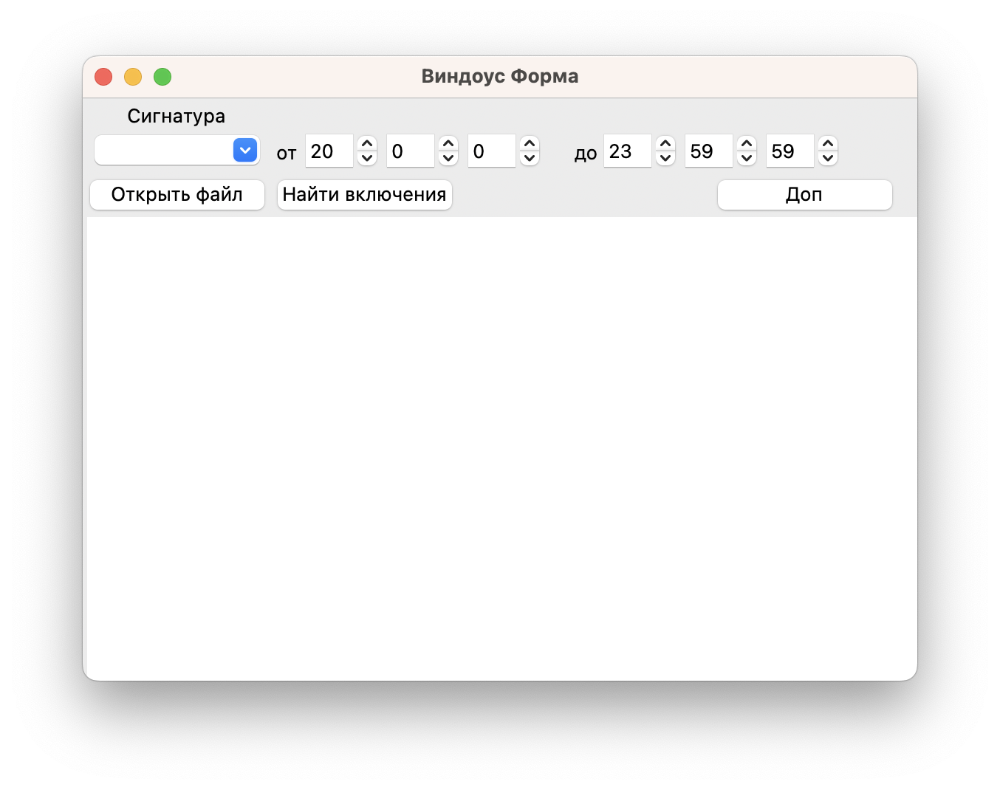
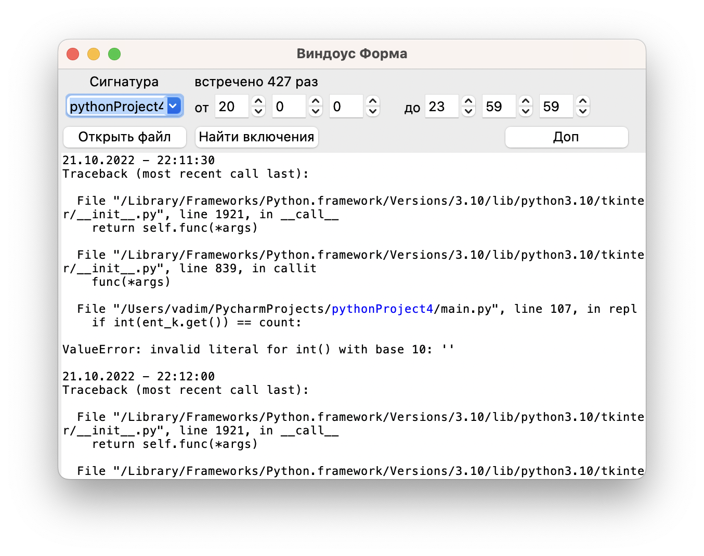
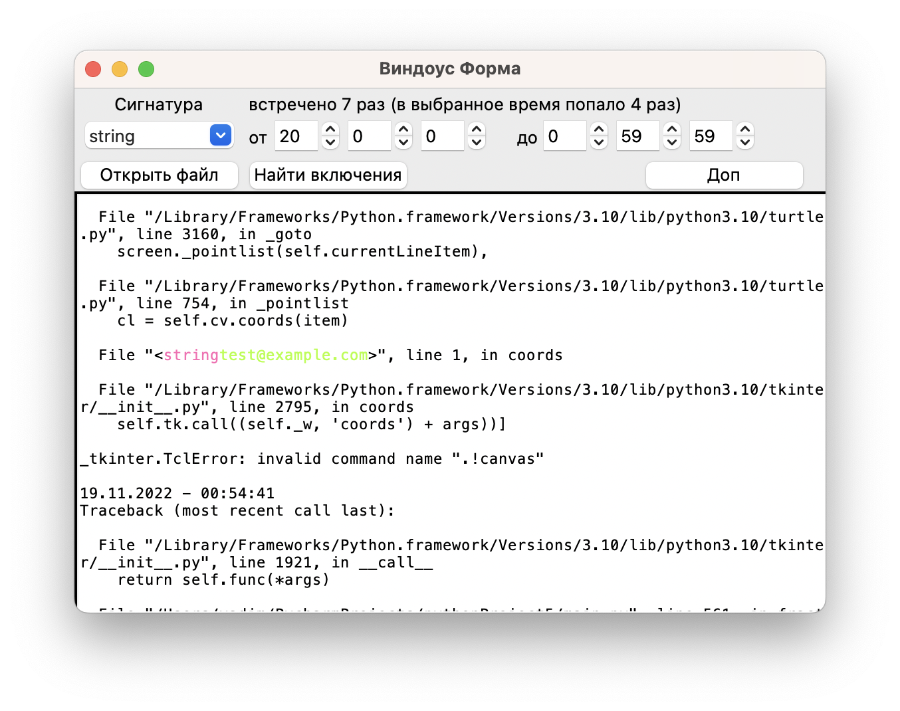
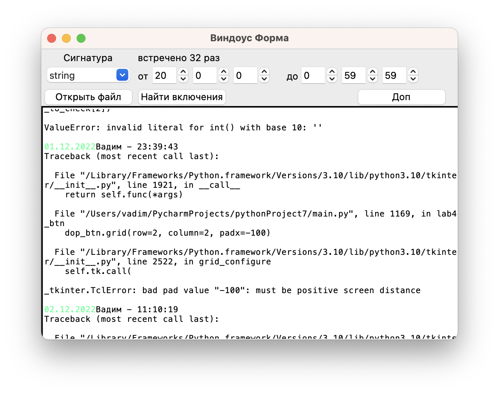

Цель работы:

Получить навыки работы с регулярными выражениями, поиска сигнатур в логе
обработки исключений, замены и извлечения «подозрительных» словоформ.
Разработка динамических библиотек.

Задание к лабораторной работе:

1.  В проекте с лабораторными работами добавить форму с функционалом
    парссинга текста по материалам лекции. Доработать обработчик кнопки
    «Выделить включения» так, чтобы при НОВОМ выборе сигнатуры в
    comdoBox ВЫБРАННАЯ сигнатура отображалась в richBox иным цветом.

2.  Добавить функционал, когда при добавлении в richBox текста не из
    файла (ввод текста пользователем) осуществлялся поиск
    последовательно выбираемых сигнатур.

3.  Для сформированного лог-журнала на ПЕРВОЙ форме проекта определить,
    в каких формах появлялись исключения и по сколько раз они появились
    в каждой форме (включения наименований этих форм в лог-журнале
    выделить цветом)

4.  Выполнить задание в соответствии с индивидуальным вариантом.

5.  Реализовать парссинг сохраненных лог-журналов в DLL (для каждого
    регулярного выражения отдельный класс в DLL). Определить время
    парссинга каждого журнала и всех выбранных журналов.

Ход работы:

Программа вносит изменения в 2 условные части общего программного
проекта: главную форму и форму собственно самого задания. Главная форма
проекта в соответствии с пунктом 3 общего задания к лабораторной работе
модифицирована и теперь помимо текущего исключения отображает также
результат парссинга лог-журналов, показывая в каких формах появлялись
исключения и по сколько раз они появлялись в каждой форме. Графическое
представление соответствующей формы представлено на Рисунке 1:

{width="6.314284776902887in"
height="2.231659011373578in"}\
*Рисунок 1 -- Новый интерфейс главной формы проекта*

Теперь рассмотрим вторую часть текущей лабораторной работы. После
перехода на вкладку «Технологии и методы программирования» -- «ЛР4»
пользователь видит форму, представленную на Рисунке 2:

{width="5.4609787839020125in"
height="4.323611111111111in"}\
*Рисунок 2 -- Интерфейс формы ЛР4*

С помощью кнопки «Открыть файл» пользователь может выбрать текстовый
файл, содержимое которого будет отображено в соответствующем текстовом
поле ниже и по которому будет произведет дальнейший парссинг с учетом
правил, выбранных пользователем. Выпадающий список в верхнем левом углу
формы позволяет пользователю выбрать сигнатуру для парссинга из
подготовленных заранее или ввести самостоятельно новую. Кнопка «Найти
включения» запускает процесс парссинга. Кнопка «Доп» инициирует
выполнение дополнительного задания (оно будет подробно рассмотрено чуть
далее). Также на форме присутствует два поля для выбора времени, которые
имеют значения по умолчанию 20:00:00 и 23:59:59, они используются для
части индивидуального задания к лабораторной работе №4 (Вариант 7):

В результате парссинга выделить в лог-журнале все включения со
словоформами string без учета регистра, добавив к ним иным цветом свой
электронный адрес, если эти вхождения, попали времени, введённый
пользователем (от \<чч.мм,сек\> до \<чч.мм,сек\>).

Интерфейс формы лабораторной работы этой части представлен на Рисунке 3:

{width="6.499305555555556in"
height="5.145683508311461in"}*Рисунок 3 -- Интерфейс рабочей формы*

В примере выше пользователь выбрал сигнатуру «pythonProject4» и произвел
парссинг по файлу «exceptions.txt». Можно заметить, что соответствующие
вхождения в текстовом поле формы выделены цветом (в примере --- синим),
что говорит о верной работе программы. А также сверху появилась
информирующая надпись о том, сколько соответствующих вхождений сигнатуры
было найдено (в примере --- 427).

Теперь продемонстрируем работу части индивидуального задания с поиском
вхождений «string» и добавления к ним другим цветом адреса электронной
почты при попадании сигнатуры в заданный временной интервал. Результат
представлен на Рисунке 4:

{width="6.27511154855643in"
height="4.968182414698163in"}\
*Рисунок 4 -- Интерфейс формы после выполнения индивидуального задания*

Можно заметить, что программа работает корректно: сигнатура «string»
была верно выделена в парссируемом тексте, а так же на приведенном
скриншоте видно, что к ней был добавлен адрес электронной почты, потому
что вхождение попало в выбранный пользователем интервал времени от
20:00:00 до 0:59:59 (демонстрируемая на скриншоте сигнатура имеет
временную отметку 0:50:15). Причем видно, что адрес электронной почты
был добавлен не ко всем «string» в тексте, а только к 4 из 7, о чем
говорит соответствующая информационная надпись в верхней части формы.

# Дополнительное задание.

Задание:

Выделение дат от 30.11.2022 до 04.12.2022 и добавление к этим логам
имени.

Сразу после запуска модуля «Доп», происходи парсинг файла
«exceptions.txt». В результате все удовлетворяющие условию задания
вхождения дат выделяются цветом и к ним дописывается имя. А
информирующая надпись сверху сообщает о том, сколько было найдено таких
дат (в примере --- 30). Пример интерфейса представлен на Рисунке 10:

{width="6.093333333333334in"
height="4.82426290463692in"}\
*Рисунок 5 -- Модуль «Доп» после выполнения работы*
